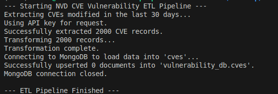
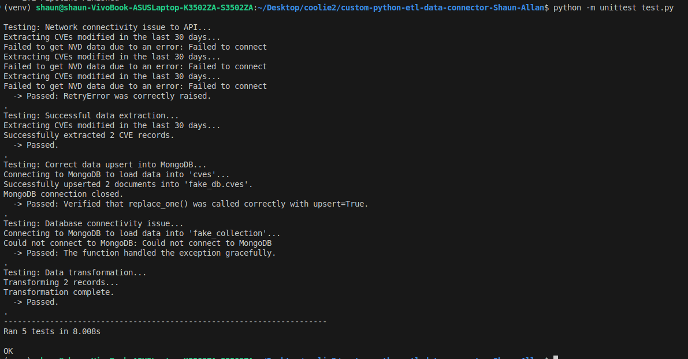

# NVD CVE Vulnerability ETL Pipeline - Shaun Allan H - 3122225001127

This project is a robust, modular, and well-tested ETL (Extract, Transform, Load) pipeline built in Python. It extracts detailed information on cybersecurity vulnerabilities (CVEs) from the U.S. National Vulnerability Database (NVD), performs targeted transformations to create a clean and usable data structure, and loads the results into a MongoDB collection using an efficient synchronization strategy.

This connector was developed as part of the SSN College of Engineering's Software Architecture assignment with Kyureeus EdTech.

## Table of Contents

- [NVD CVE Vulnerability ETL Pipeline - Shaun Allan H - 3122225001127](#nvd-cve-vulnerability-etl-pipeline---shaun-allan-h---3122225001127)
  - [Table of Contents](#table-of-contents)
  - [Project Overview](#project-overview)
    - [Key Features](#key-features)
  - [API Details: NVD CVE API](#api-details-nvd-cve-api)
  - [The ETL Pipeline Explained](#the-etl-pipeline-explained)
    - [1. Extract](#1-extract)
    - [2. Transform](#2-transform)
    - [3. Load](#3-load)
  - [Data Transformation Example](#data-transformation-example)
    - [Before Transformation (Raw API Data)](#before-transformation-raw-api-data)
    - [After Transformation (Loaded to MongoDB)](#after-transformation-loaded-to-mongodb)
  - [Project Structure](#project-structure)
  - [Setup and Installation](#setup-and-installation)
  - [How to Run](#how-to-run)
    - [Running the ETL Pipeline](#running-the-etl-pipeline)
    - [Running the Tests](#running-the-tests)
  - [Testing Strategy](#testing-strategy)
  - [Output](#output)

-----

## Project Overview

The pipeline executes a multi-step process to gather, process, and store data on cybersecurity vulnerabilities, demonstrating a professional approach to building data connectors. It is designed to be resilient, handling network timeouts and temporary API errors with an automatic retry mechanism, and efficient, by fetching only recently updated data.

### Key Features

  * **Modular Architecture**: Code is separated into distinct modules for configuration and core ETL logic (`pipeline.py`).
  * **Advanced Transformations**: Flattens the complex, nested JSON from the NVD API into a clean, structured format, extracting key details like severity scores, CVSS vectors, and descriptions.
  * **Efficient Database Synchronization**: Uses an "upsert" strategy to load data. New vulnerabilities are added, and existing ones are updated if they've changed, ensuring the database is always synchronized without redundant writes.
  * **Resilient by Design**: Implements timeouts and automatic retries with exponential backoff to handle network or API instability.
  * **Secure Credential Management**: All configuration, including API keys and database URIs, is managed securely using a `.env` file.
  * **Comprehensive Testing**: Includes a unified test suite that validates business logic and system robustness against simulated API and database errors.
  * **Automated & Targeted Fetching**: Automatically fetches vulnerabilities modified in the last 30 days, making it ideal for scheduled, recurring execution (e.g., via a cron job) to keep a database continuously updated.

-----

## API Details: NVD CVE API

This project utilizes the CVE API from the U.S. **National Vulnerability Database (NVD)**, a comprehensive cybersecurity resource maintained by NIST.

  * **`GET /rest/json/cves/2.0`**
      * **Purpose:** This is the primary endpoint for fetching vulnerability data. The script queries this endpoint with parameters to retrieve a list of all CVEs that have been published or modified within a specific date range (e.g., the last 30 days). The API returns a rich JSON object containing detailed information for each vulnerability. An optional API key can be included in the request header to achieve a higher rate limit.

-----

## The ETL Pipeline Explained

### 1\. Extract

The extraction process makes a single, efficient API call to gather all necessary raw data:

  * **Date Calculation**: First, the script calculates a date range corresponding to the last 30 days.
  * **API Request**: It then queries the NVD API, requesting all CVEs modified within that calculated date range. The raw response is a JSON object containing a list of vulnerability records.

### 2\. Transform

This is the core of the pipeline, where the complex raw data is simplified into a clean, flat, and useful structure.

  * The script iterates through each raw CVE object received from the API.
  * **Data is Flattened**: It navigates the nested JSON structure to pull out the most important fields, such as:
      * `cve_id` (e.g., "CVE-2025-0001")
      * `description`
      * `published_date` and `last_modified_date`
      * CVSS v3.1 `base_score`, `severity`, and `vector_string`
  * An `ingestion_timestamp` is added to track when the record was processed.

### 3\. Load

The final, transformed records are loaded into a MongoDB database using a best-practice synchronization strategy.

  * The script connects to the specified MongoDB instance and collection.
  * For each CVE record, it uses **`replace_one`** with **`upsert=True`**. This powerful command tells MongoDB:
      * **If** a document with the same `cve_id` already exists, **replace** it with this new, updated record.
      * **If not**, **insert** this record as a new document.
  * This ensures the database is always an up-to-date mirror of the source data without creating duplicates.

-----

## Data Transformation Example

To understand the transformation process, here is an example of the "before" and "after" data for a single CVE.

### Before Transformation (Raw API Data)

The script receives a deeply nested JSON object for each vulnerability from the NVD API.

```json
{
  "cve": {
    "id": "CVE-2025-0001",
    "published": "2025-07-20T18:15:09.917",
    "lastModified": "2025-08-10T08:15:11.783",
    "descriptions": [{"lang": "en", "value": "A critical vulnerability in a test web server."}],
    "metrics": {
      "cvssMetricV31": [
        {
          "cvssData": {
            "version": "3.1",
            "vectorString": "CVSS:3.1/AV:N/AC:L/PR:N/UI:N/S:U/C:H/I:H/A:H",
            "baseScore": 9.8,
            "baseSeverity": "CRITICAL"
          }
        }
      ]
    }
  }
}
```

### After Transformation (Loaded to MongoDB)

The script processes the raw data, flattens the structure, and prepares a clean document for MongoDB.

```json
{
  "cve_id": "CVE-2025-0001",
  "published_date": "2025-07-20T18:15:09.917",
  "last_modified_date": "2025-08-10T08:15:11.783",
  "description": "A critical vulnerability in a test web server.",
  "base_score": 9.8,
  "severity": "CRITICAL",
  "vector_string": "CVSS:3.1/AV:N/AC:L/PR:N/UI:N/S:U/C:H/I:H/A:H",
  "ingestion_timestamp": "2025-08-14T18:30:00.123Z"
}
```

-----

## Project Structure

```
/SSN-college-software-architecture-Assignments/
├── .env
├── ENV_TEMPLATE
├── config.py
├── pipeline.py
├── etl_connector.py
├── test.py
└── requirements.txt
```

-----

## Setup and Installation

1.  **Clone the repository** to your local machine.
2.  **Create and activate a virtual environment**:
    ```bash
    python -m venv venv
    source venv/bin/activate  # On Windows, use `venv\Scripts\activate`
    ```
3.  **Install dependencies**:
    ```bash
    pip install -r requirements.txt
    ```
4.  **Create your environment file**:
    Create a file named `.env` by copying the `.env.template`. Then, fill in your credentials.
    ```bash
    cp .env.template .env
    ```
    Your `.env` file must contain the following variables:
    ```ini
    # NVD API key is optional but recommended for higher rate limits.
    # Get one here: https://nvd.nist.gov/developers/request-an-api-key
    NVD_API_KEY="your-nvd-api-key-here"

    # Your MongoDB connection string
    MONGO_URI="mongodb://localhost:27017/"

    # You can customize the DB and collection names if you wish
    DB_NAME="vulnerability_db"
    COLLECTION_NAME="cves"
    ```

-----

## How to Run

### Running the ETL Pipeline

To run the main script, simply execute the `etl_connector.py` file. It does not require any command-line arguments.

```bash
python etl_connector.py
```
**Output:**


### Running the Tests

To run the consolidated test suite, use the following command:

```bash
python -m unittest test.py
```
**Output:**


-----

## Testing Strategy

The pipeline is validated by a comprehensive `test.py` file that covers the project's validation requirements. It includes two types of tests within a single suite:

1.  **Transformation Logic Tests**: These tests validate the core business logic for flattening the NVD JSON data, using pre-defined sample data to ensure the output is correct.
2.  **Pipeline Robustness Tests**: These tests use **mocking** to simulate and verify that the pipeline can gracefully handle external issues like API errors (e.g., network timeouts) and database connection failures.

-----

## Output

