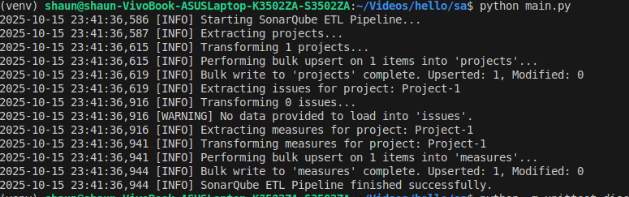
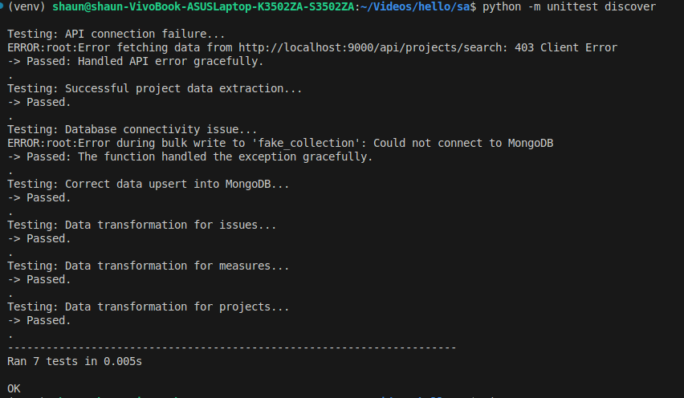
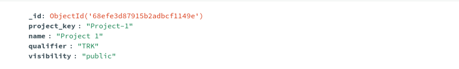
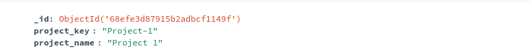

# SonarQube Analysis ETL Pipeline - Shaun Allan H

This project is a robust, modular, and well-tested ETL (Extract, Transform, Load) pipeline built in Python. It extracts key software quality and security metrics from a SonarQube instance, performs complex transformations to create clean and analytics-ready data structures, and loads the results into a MongoDB database for further analysis and reporting.

This connector was developed as part of a Software Architecture assignment.

## Table of Contents

  - SonarQube Analysis ETL Pipeline - Shaun Allan H
      - Table of Contents
      - Project Overview
          - Key Features
      - API Details: SonarQube Web API
      - The ETL Pipeline Explained
          - 1. Extract
          - 2. Transform
          - 3. Load
      - Data Transformation Example
          - Before Transformation (Raw API Data)
          - After Transformation (Loaded to MongoDB)
      - Project Structure
      - Setup and Installation
      - How to Run
          - Running the ETL Pipeline
          - Running the Tests
      - Testing Strategy
      - Output

-----

## Project Overview

The pipeline executes a multi-step process to gather, process, and store data on code quality, vulnerabilities, and project metrics. It demonstrates a professional approach to building data connectors by separating concerns, handling API pagination gracefully, and using efficient database operations. The goal is to create a centralized data warehouse of SonarQube metrics for historical analysis, dashboarding, and custom reporting.

### Key Features

  * **Modular Architecture**: Code is logically separated into distinct modules for extraction (`extract.py`), transformation (`transform.py`), loading (`load.py`), and orchestration (`etl_connector.py`).
  * **Complex Transformations**: Flattens nested JSON from the SonarQube API, converts data types, and enriches the data by adding calculated fields (e.g., classifying issues as critical).
  * **Efficient Bulk Synchronization**: Uses MongoDB's `bulk_write` with an "upsert" strategy. This single, efficient operation adds new records and updates existing ones if they've changed, ensuring the database is always synchronized without duplicates.
  * **Handles API Pagination**: Includes a reusable function that automatically handles paginated API responses to ensure all records (projects, issues, etc.) are extracted, regardless of the total count.
  * **Secure Configuration Management**: All configuration, including API tokens and database URIs, is managed in a central `config/settings.py` file, keeping it separate from application logic.
  * **Comprehensive Unit Testing**: Includes a robust test suite using `unittest` and `unittest.mock` to validate business logic and ensure the pipeline can gracefully handle simulated API and database errors without live connections.

-----

## API Details: SonarQube Web API

This project utilizes the official REST API provided by SonarQube to fetch project and analysis data. Authentication is handled via a user-generated API token.

  * **`GET /api/projects/search`**
      * **Purpose:** Fetches a list of all projects available in the SonarQube instance. This is the starting point for the pipeline.
  * **`GET /api/issues/search`**
      * **Purpose:** Retrieves all issues (bugs, vulnerabilities, code smells) for a specific project. This endpoint is called iteratively for each project found.
  * **`GET /api/measures/component`**
      * **Purpose:** Gathers key metrics (e.g., code coverage, duplication, complexity) for a specific project.

-----

## The ETL Pipeline Explained

### 1\. Extract

The extraction process intelligently queries the SonarQube API to gather all relevant data.

  * **Fetch Projects**: The pipeline begins by making an API call to get a complete list of all projects.
  * **Iterative Extraction**: It then loops through each project key and makes separate API calls to fetch its associated issues and code measures.
  * **Pagination Handling**: All API calls are routed through a helper function that automatically handles pagination, ensuring that all pages of data are fetched and combined.

### 2\. Transform

This is the core of the pipeline, where raw data is cleaned, reshaped, and enriched.

  * The script processes three types of data: projects, issues, and measures, each with its own transformation logic.
  * **Data is Cleaned**: Unnecessary fields are removed, and the remaining data is structured into a clean schema.
  * **Data is Enriched**: For issues, a new boolean field `is_critical_or_blocker` is calculated based on the issue's severity.
  * **Data is Flattened**: The nested `measures` data from the API is transformed into a single, flat document for easy querying.

### 3\. Load

The final, transformed records are loaded into separate MongoDB collections using an efficient bulk operation.

  * The script connects to the specified MongoDB instance.
  * For each data type (projects, issues, measures), it uses **`bulk_write`** with **`UpdateOne`** and **`upsert=True`**. This powerful command tells MongoDB:
      * **If** a document with the same unique key (`project_key` or `issue_key`) exists, **update** it with the new data.
      * **If not**, **insert** this record as a new document.
  * This ensures high performance and data consistency, making the pipeline idempotent and safe to run repeatedly.

-----

## Data Transformation Example

To understand the value of the transformation, here is an example of the "before" and "after" data for project measures.

### Before Transformation (Raw API Data)

The script receives a nested JSON object containing a list of measure objects.

```json
{
  "component": {
    "key": "my-awesome-project",
    "name": "My Awesome Project",
    "measures": [
      {
        "metric": "bugs",
        "value": "15"
      },
      {
        "metric": "vulnerabilities",
        "value": "7"
      },
      {
        "metric": "coverage",
        "value": "92.3"
      }
    ]
  }
}
```

### After Transformation (Loaded to MongoDB)

The script processes the raw data, flattens the structure, and prepares a clean document for MongoDB.

```json
{
  "project_key": "my-awesome-project",
  "project_name": "My Awesome Project",
  "bugs": 15.0,
  "vulnerabilities": 7.0,
  "coverage": 92.3
}
```

-----

## Project Structure

```
sonarqube_etl/
├── config/
│   └── settings.py
├── etl/
│   ├── __init__.py
│   ├── extract.py
│   ├── transform.py
│   ├── load.py
│   └── etl_connector.py
├── tests/
│   ├── __init__.py
│   └── test_etl.py
├── utils/
│   └── logger.py
├── .gitignore
├── main.py
└── requirements.txt
```

-----

## Setup and Installation

1.  **Clone the repository** to your local machine.
2.  **Create and activate a virtual environment**:
    ```bash
    python -m venv venv
    source venv/bin/activate  # On Windows, use `venv\Scripts\activate`
    ```
3.  **Install dependencies**:
    ```bash
    pip install -r requirements.txt
    ```
4.  **Configure your settings**:
    Open the `config/settings.py` file and fill in your SonarQube and MongoDB details.
    ```python
    # SonarQube Configuration
    SONARQUBE_URL = "http://localhost:9000"  # Change to your SonarQube instance URL
    SONARQUBE_API_TOKEN = "your_sonarqube_api_token" # Paste your token here

    # MongoDB Configuration
    MONGO_URI = "mongodb://localhost:27017/" # Your MongoDB connection string
    MONGO_DATABASE = "sonarqube_data"
    MONGO_PROJECTS_COLLECTION = "projects"
    MONGO_ISSUES_COLLECTION = "issues"
    MONGO_MEASURES_COLLECTION = "measures"
    ```

-----

## How to Run

### Running the ETL Pipeline

To run the main script and start the ETL process, execute the `main.py` file.

```bash
python main.py
```



### Running the Tests

To run the complete test suite, use the `unittest discover` command from the project root.

```bash
python -m unittest discover
```



-----

## Testing Strategy

The pipeline is validated by a comprehensive `tests/test_etl.py` file that covers all modules of the project. The strategy focuses on unit tests that run in isolation without requiring live service connections.

1.  **Transformation Logic Tests**: These tests validate the core business logic of the `transform.py` module. They use sample raw data to assert that the output structure and calculated fields are correct.
2.  **Pipeline Robustness Tests**: These tests use **`unittest.mock`** to simulate API and database behavior. They verify that the pipeline can gracefully handle external issues like API errors (e.g., 403 Forbidden) and database connection failures without crashing.

-----

## Output

After a successful run, the data will be available in your MongoDB instance. You can use a tool like MongoDB Compass to view the collections (`projects`, `issues`, and `measures`) inside the `sonarqube_data` database.



