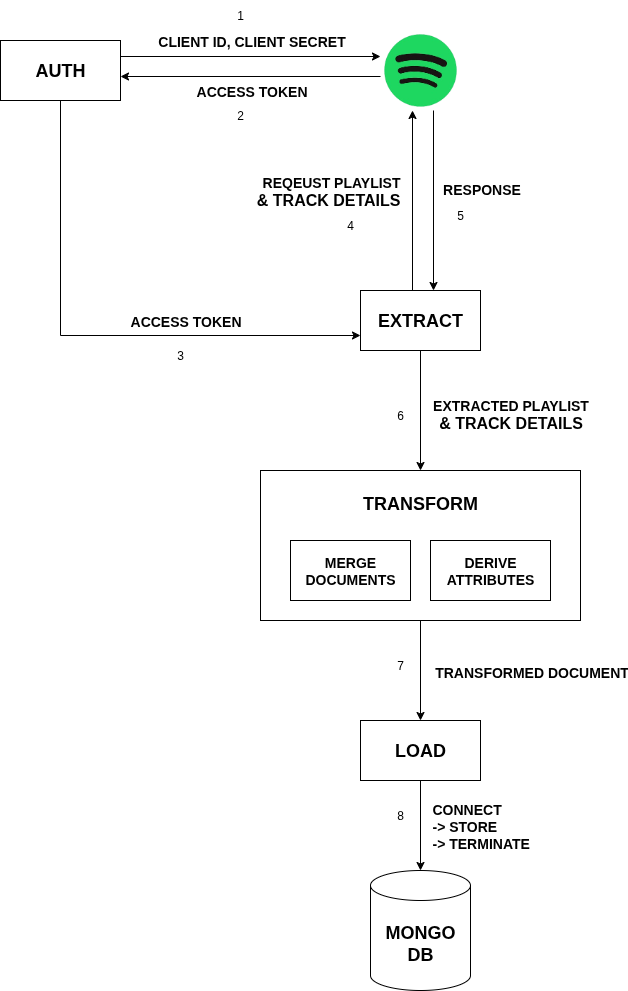
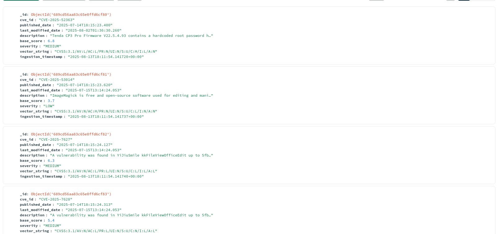

# Spotify Playlist ETL Connector - Shaun Allan H - 3122225001127

This project is a robust, modular, and well-tested ETL (Extract, Transform, Load) pipeline built in Python. It extracts detailed metadata and track information for a given public Spotify playlist, performs a series of complex transformations to enrich the data, and loads the final, merged document into a MongoDB collection.

This connector was developed as part of the SSN College of Engineering's Software Architecture assignment with Kyureeus EdTech.

## Project Overview

The pipeline executes a multi-step process to gather, process, and store data, demonstrating a professional approach to building data connectors. It is designed to be resilient, handling network timeouts and temporary API errors with an automatic retry mechanism.

### Key Features

  * **Modular Architecture**: Code is separated into distinct modules for authentication, configuration, and ETL logic.
  * **Advanced Transformations**: The pipeline doesn't just move data; it creates new, insightful fields such as album age, market availability, and popularity tiers.
  * **Embedded Data Model**: All data for a single playlist, including its list of transformed tracks, is stored as a single document in MongoDB.
  * **Resilient by Design**: Implements timeouts and automatic retries with exponential backoff to handle network or API instability.
  * **Secure Credential Management**: All sensitive keys and URIs are managed securely using a `.env` file.
  * **Comprehensive Testing**: The project includes a single, unified test suite that validates both business logic and system robustness.
  * **Flexible Execution**: The target playlist ID is provided as a command-line argument, making the script highly reusable.


### Architecture Diagram



-----

## The ETL Pipeline Explained

### 1\. Extract

The extraction process is performed in two main steps to gather all the necessary raw data:

  * **Playlist Details**: First, a call is made to the `/v1/playlists/{id}` endpoint to get the playlist's own metadata (name, description, owner, follower count).
  * **Track Details**: The script then extracts a list of all track IDs from the playlist. These IDs are then used to make a bulk call to the `/v1/tracks` endpoint to get the rich, full details for up to 100 tracks at once.

### 2\. Transform

This is the core of the pipeline where raw data is turned into valuable information.

  * The raw playlist and track data are merged into a single document.
  * **New Fields are Created**:
      * `album_age_years`: Calculated by subtracting the album's `release_date` from the current year.
      * `is_available_in_india`: A boolean field calculated by checking if `"IN"` is present in the `available_markets` list.
      * `popularity_tier`: The numerical `popularity` score (0-100) is categorized into descriptive tiers ("Niche", "Popular", "Mainstream Hit").
  * **Data is Cleaned**: Nested objects (like `artists`) are simplified into clean lists of names.

### 3\. Load

The final, transformed document is loaded into a MongoDB database.

  * The script connects to the specified MongoDB instance and database.
  * It uses `replace_one` with `upsert=True`, which means if a document for that playlist already exists, it will be completely replaced. If it doesn't exist, it will be created. This ensures the data is always up-to-date.

-----

## Data Transformation Example

To understand the transformation process, here is an example of the "before" and "after" data for a single track.

### Before Transformation (Raw API Data)

The script receives a raw playlist object and a list of raw track objects from the API. They are complex, nested, and contain many unnecessary fields.

**Raw Playlist Snippet:**

```json
{
  "id": "70ROJroKWQhEKSDCzc3QG6",
  "name": "Spider man",
  "description": "",
  "owner": {
    "display_name": "Shaun"
  },
  "followers": {
    "total": 0
  },
  "tracks": {
    "total": 8
  }
}
```

**Raw Track Snippet:**

```json
{
  "album": {
    "name": "METRO BOOMIN PRESENTS SPIDER-MAN: ACROSS THE SPIDER-VERSE...",
    "release_date": "2023-06-02"
  },
  "artists": [
    {
      "id": "0iEtIxbK0KxaSlF7G42ZOp",
      "name": "Metro Boomin"
    },
    {
      "id": "1zNqQNIdeOUZHb8zbZRFs7",
      "name": "Swae Lee"
    }
  ],
  "available_markets": ["CA", "US", "IN"],
  "id": "5rurggqwwudn9clMdcchxT",
  "name": "Calling (Spider-Man: Across the Spider-Verse)...",
  "popularity": 70
}
```

### After Transformation (Loaded to MongoDB)

The script processes the raw data, calculates new fields, cleans up the structure, and merges everything into a single, clean document like the one below.

```json
{
  "playlist_id": "70ROJroKWQhEKSDCzc3QG6",
  "name": "Spider man",
  "description": "",
  "owner": "Shaun",
  "total_followers": 0,
  "ingestion_timestamp": "2025-08-09T18:30:00.123Z",
  "tracks": [
    {
      "track_id": "5rurggqwwudn9clMdcchxT",
      "track_name": "Calling (Spider-Man: Across the Spider-Verse) (Metro Boomin & Swae Lee, NAV, feat. A Boogie Wit da Hoodie)",
      "artists": ["Metro Boomin", "Swae Lee", "NAV", "A Boogie Wit da Hoodie"],
      "album_name": "METRO BOOMIN PRESENTS SPIDER-MAN: ACROSS THE SPIDER-VERSE (SOUNDTRACK FROM AND INSPIRED BY THE MOTION PICTURE)",
      "album_age_years": 2,
      "is_available_in_india": true,
      "popularity_tier": "Popular"
    },
    {
      "track_id": "6Ec5LeRzkisa5KJtwLfOoW",
      "track_name": "Am I Dreaming (Metro Boomin & A$AP Rocky, Roisee)",
      "artists": ["Metro Boomin", "A$AP Rocky", "Roisee"],
      "album_name": "METRO BOOMIN PRESENTS SPIDER-MAN: ACROSS THE SPIDER-VERSE (SOUNDTRACK FROM AND INSPIRED BY THE MOTION PICTURE)",
      "album_age_years": 2,
      "is_available_in_india": true,
      "popularity_tier": "Mainstream Hit"
    }
  ]
}
```

-----

## Project Structure

```
/SSN-college-software-architecture-Assignments/
├── .env
├── config.py
├── auth.py
├── pipeline.py
├── etl_connector.py
├── test.py
└── requirements.txt
```

-----

## Setup and Installation

1.  **Clone the repository** to your local machine.
2.  **Create and activate a virtual environment**:
    ```bash
    python -m venv venv
    source venv/bin/activate  # On Windows, use `venv\Scripts\activate`
    ```
3.  **Install dependencies**:
    ```bash
    pip install -r requirements.txt
    ```
4.  **Create your environment file**:
    Create a file named `.env` in the project root and add your credentials. It must follow this format:
    ```ini
    SPOTIFY_CLIENT_ID="your-client-id-here"
    SPOTIFY_CLIENT_SECRET="your-client-secret-here"
    MONGO_URI="mongodb://localhost:27017/"
    ```

-----

## How to Run

### Running the ETL Pipeline

To run the main script, you must provide a public Spotify Playlist ID as a command-line argument.

**Format:**

```bash
python etl_connector.py <PLAYLIST_ID>
```

**Example:**

```bash
python etl_connector.py 70ROJroKWQhEKSDCzc3QG6
```

### Running the Tests

To run the consolidated test suite, use the following command:

```bash
python -m unittest test.py
```

-----

## Testing Strategy

The pipeline is validated by a comprehensive `test.py` file that covers all the assignment's validation requirements. It includes two types of tests within a single suite:

1.  **Transformation Logic Tests**: These tests validate the core business logic. They use pre-defined sample raw data and assert that the output of the transformation functions exactly matches a desired, correctly calculated structure.
2.  **Pipeline Robustness Tests**: These tests use **mocking** to simulate various failure scenarios. They verify that the pipeline can gracefully handle external issues like API errors (e.g., 404, 429), network connectivity problems, and database connection failures without crashing.

-----

## Output
